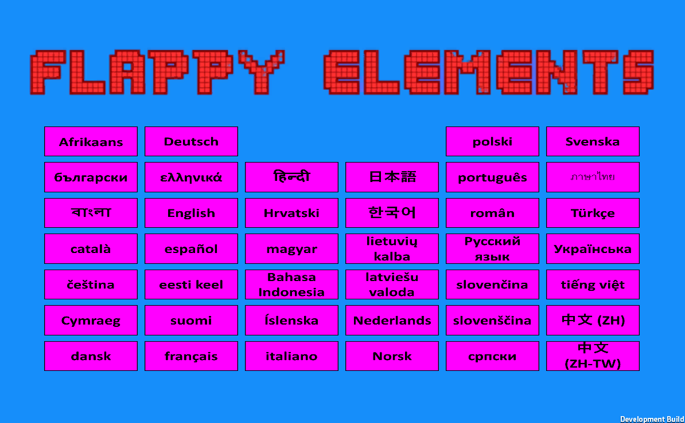
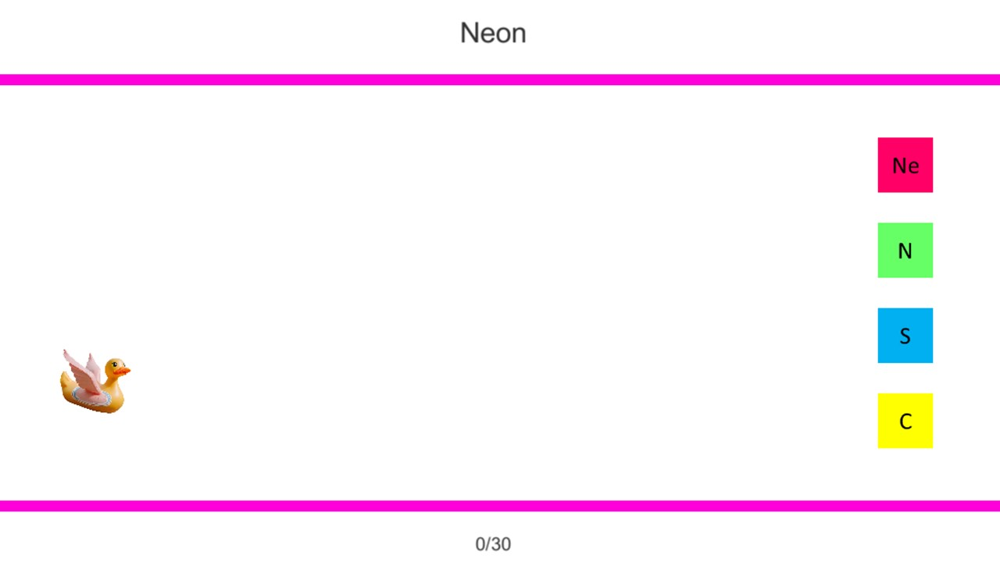
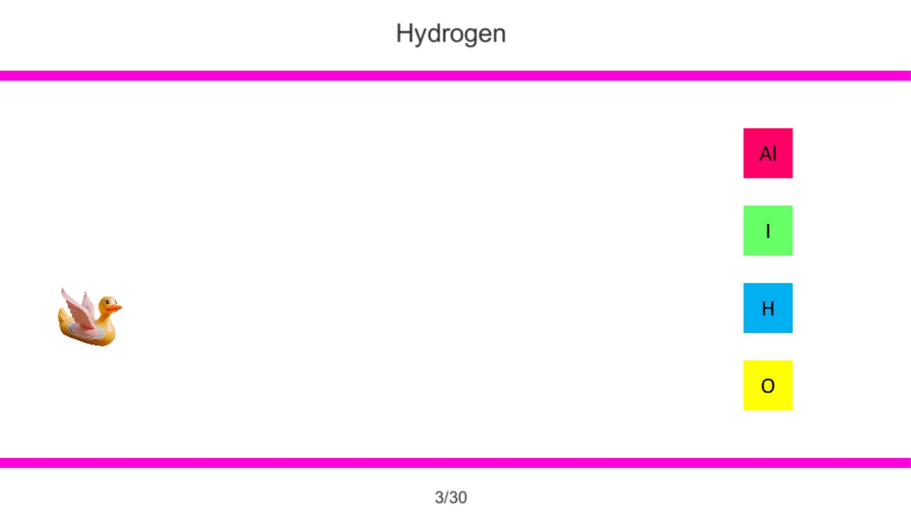
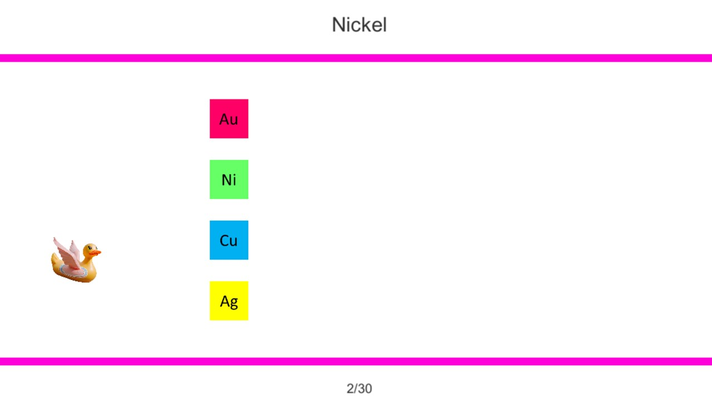
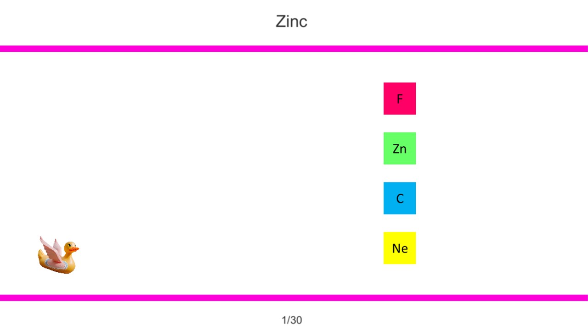

# Flappy Elements

Flappy Elements is a fun and educational chemistry learning game that helps players practice the names and symbols of elements in 40 different languages. The game is based on the popular Flappy Bird concept, providing a unique way to learn the fundamentals of chemistry.

## Game Description

Players control a bird character that must navigate within the upper and lower boundaries of the game area. At the top of the screen, the name of an element is displayed, and the player's task is to collide with the correct block that corresponds to the symbol of the element shown above. There are four overlapping blocks representing different element symbols.

## Game Rules

The player loses the game if the bird character hits the wrong block or collides with the upper or lower boundaries of the game area.

## Features

- Practice the names and symbols of elements in 40 different languages.
- Engaging and addictive gameplay based on the Flappy Bird mechanics.
- Simple and intuitive user interface suitable for all age groups.

Play Flappy Elements and start learning chemistry in a fun way!

## Screenshots

## Also available for Android devices

